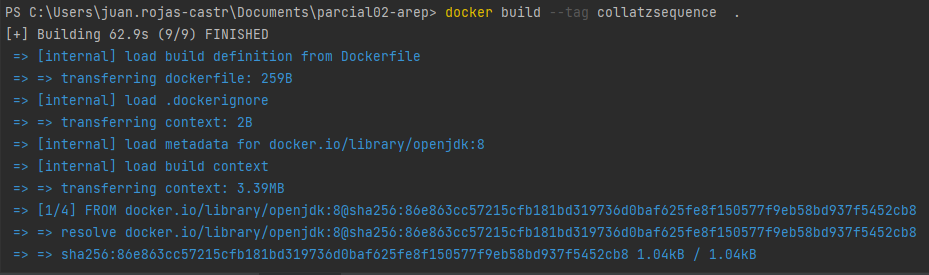
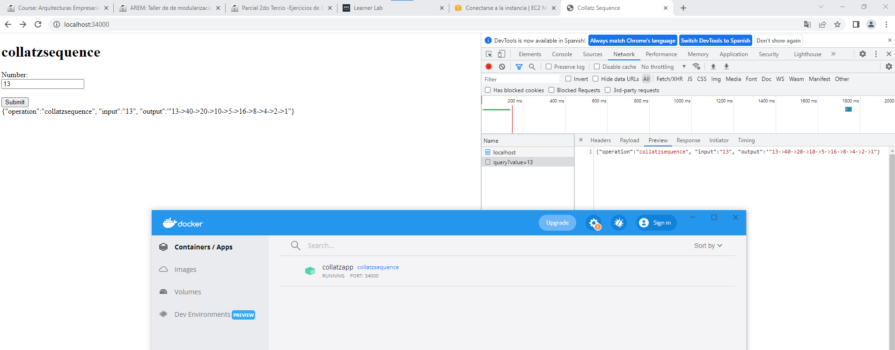
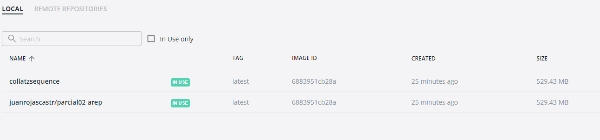
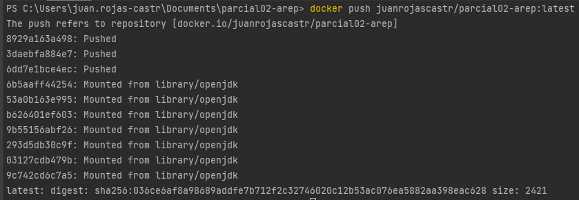
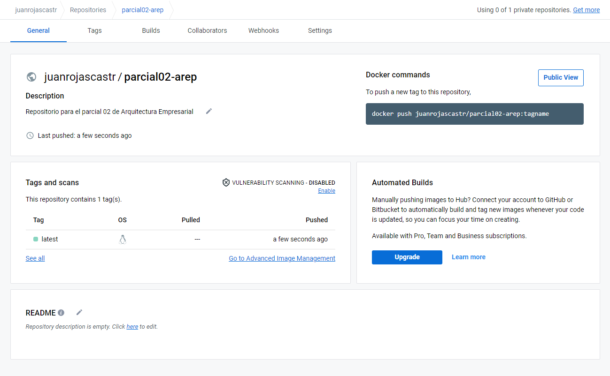
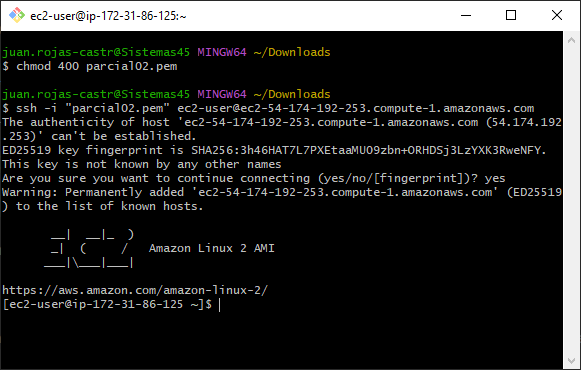
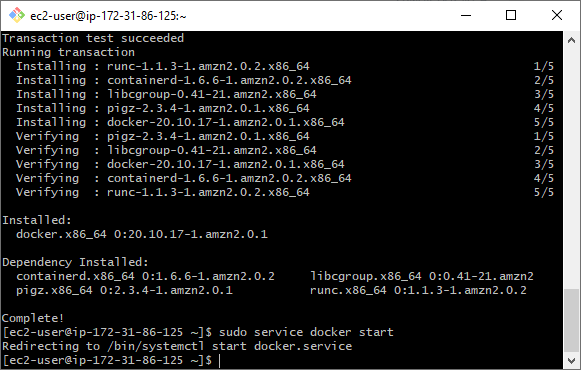
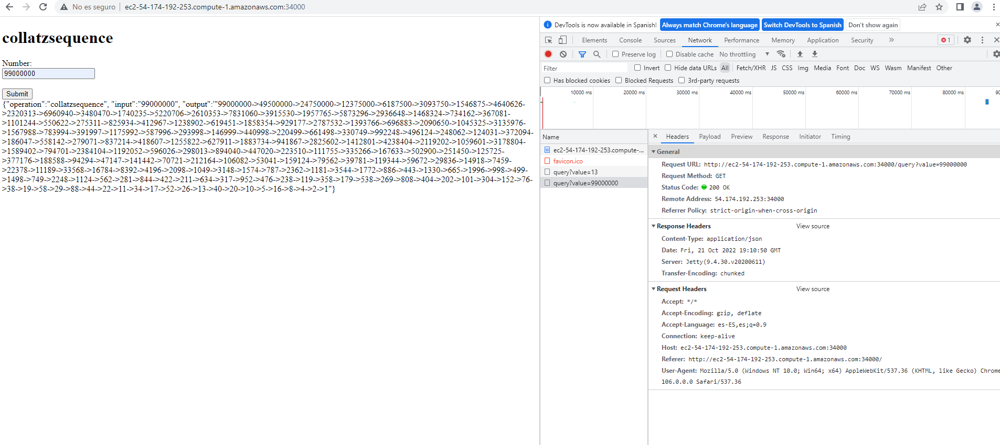

# PARCIAL 02 AREP

#### Autor: Juan Camilo Rojas Castro

## Descripción 

Este repositorio contiene el proyecto para el parcial 02 de Arquitectura Empresarial, este consiste en una arquitectura cliente
servidor corriendo en un contenedor de docker en una máquina virtual en EC2 de AWS.

Esta aplicación consiste en un cliente web donde podemos ingresar un número y obtener la secuencia de Collatz correspondiente
a el númeor ingresado.

El servidor corriendo en docker calcula la secuencia y devuelve una respuesta con la siguiente estructura:

```
{
 "operation": "collatzsequence",

 "input":  13,

 "output":  "13->40->20->10->5->16->8->4->2->1"
}
```

### Clonar Repositorio 

Para clonar este repositorio ingrese el siguiente comando en un bash:

    git clone https://github.com/JuanRojasCastr/parcial02-arep.git

## Compilar

Abra el repositorio clonado en su editor de código de preferencia (debe tener Maven instalado)
y corra el comando:

    mvn package

Con esto compilaremos nuestro proyecto para posteriormente correrlo con docker.

## Docker

Una vez compilamos el proyecto y con el servicio de Docker corriendo en nuestra máquina debemos crear la imagen con el comando:

    docker build --tag collatzsequence  .

No hay que configurar nada, puesto que el archivo Dockerfile ya está listo.



Con la imagen ya creada debemos correrla con el comando:

    docker run -d -p 34000:6000 --name collatzapp collatzsequence

Ahora nuestra aplicación ya está corriendo, debemos ingresar al localhost:34000 y podremos ya dar uso



## DockerHub

Si ya tenemos nuestra imagen local creada podemos subirla DockerHub para poder usarla desde donde queramos.

Para subirla a DockerHub creamos un nuevo repositorio en la página de DockerHub.

Ahora con el siguiente comando creamos la imagen del repositorio local:

    docker tag collatzsequence juanrojascastr/parcial02-arep

En docker Desktop se vería algo como esto:



Ahora nos ingresamos con nuestra cuenta de Docker y le hacemos push a la imagen:





Ahora podemos usar nuestra aplicación desde cualquier lugar

## AWS

Para usar nuestra aplicación desde una máquina virtual de EC2 debemos crear la instancia, abrir el puerto 34000, luego 
nos conectamos a ella mediante ssh:



Luego instalamos docker e iniciamos el servicio y le damos permisos a nuestro usuario y volvemos a entrar:



Ahora solo queda correr la imagen:

    docker run -d -p 34000:6000 --name collatzapp juanrojascastr/parcial02-arep

Por último ingresar a la dirección de nuestra máquina (LA MÁQUINA FUE BORRADA POR LO QUE LA URL *YA* NO SIRVE):

http://ec2-54-174-192-253.compute-1.amazonaws.com:34000/


